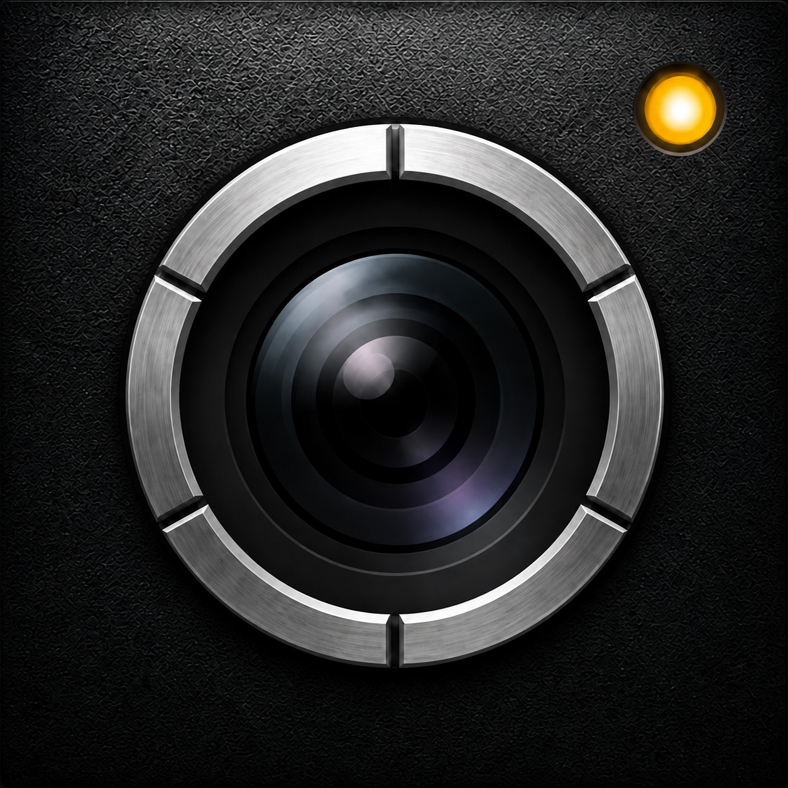
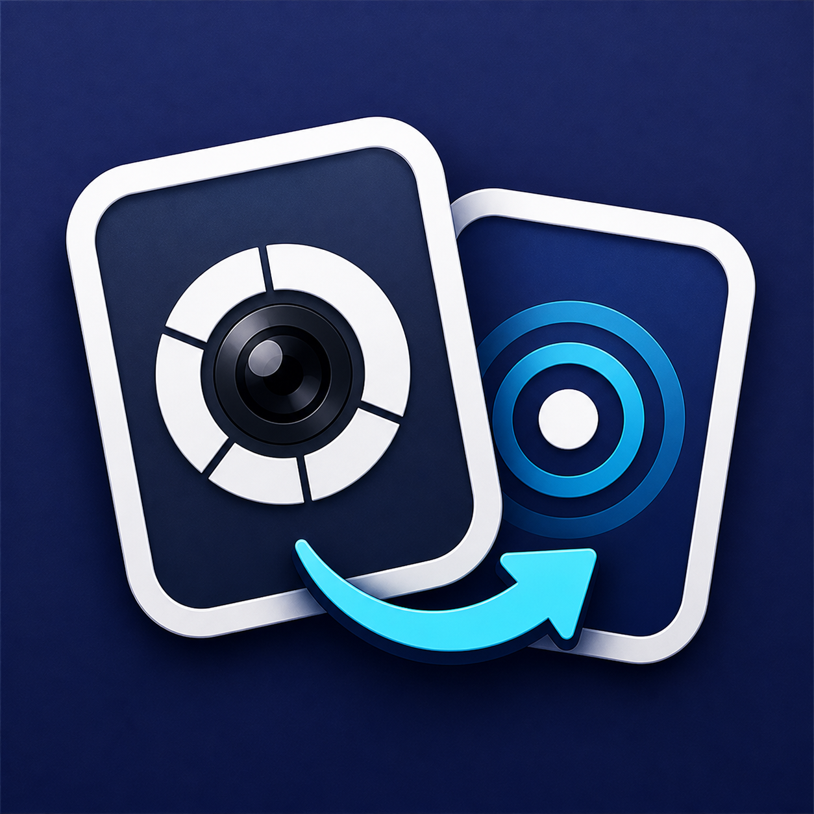

# RetroLiveApp

RetroLive 为旧款 iPhone 带来实况照片拍摄功能，并允许将其导入到现代 iPhone 中。

本项目由两部分组成：

- 用 Objective-C 编写的传统相机应用，能够拍摄独立的 JPEG 图像和短视频片段
- 现代 SwiftUI 导入器，可通过本地网络发现相机、验证下载的文件、组装实况照片，并将其保存到照片库

RetroLive 仍在积极开发中。协议、存储、传输和导入路径已实现，并通过主机或模拟器测试覆盖，但旧版 iOS 工具链构建和完整的双设备工作流仍需要真实设备测试。

## 功能特性

- iOS 6 和 iOS 7/8 时代的传统相机界面
- 独立的全分辨率 JPEG 拍摄，配合以快门事件为中心的视频片段
- 支持 `4:3`、`1:1` 和 `16:9` 画幅，无需修改相机端的原始文件
- 带有静态图像和运动回放功能的资源库
- 通过本地网络的显式六位数配对
- Bonjour 服务发现和版本化的只读 HTTP API
- 支持字节长度和 SHA-256 校验的可恢复下载
- 具有重启恢复功能的持久化序列批量导入队列
- 导入存储预检、使用情况报告和安全的本地缓存清理
- 实时照片元数据组装和 PhotoKit 导入
- 保存到照片库时保留拍摄日期和源元数据
- 运动拍摄不可用时的仅照片回退方案
- 英文、简体中文和繁体中文本地化

## 应用和兼容性

| 目标                | 用途                                      | 项目设置 | 开发工具链                                    |
| ------------------- | ----------------------------------------- | -------- | --------------------------------------------- |
| `RetroLiveCamera`   | iOS 6 风格的相机和本地资源服务器          | iOS 6.0  | 需要归档的 Xcode/iOS 6 SDK 以进行真实设备构建 |
| `RetroLiveClassic`  | 使用相同拍摄和存储核心的 iOS 7/8 时代相机 | iOS 7.0  | 使用能够为目标设备构建和签名的工具链          |
| `RetroLiveImporter` | 发现相机、下载资源并将其导入照片库        | iOS 17.0 | 支持 Swift 6 的当前 Xcode                     |

## App 图标

| 目标                | 图标                                                                                                     |
| ------------------- | -------------------------------------------------------------------------------------------------------- |
| `RetroLiveCamera`   |  |
| `RetroLiveClassic`  |       |
| `RetroLiveImporter` |     |

两个相机目标都使用 Objective-C 和 ARC。
导入器是一个 SwiftUI 应用，现代 Xcode 安装可以检查和主机检查相机源代码的大部分内容，但无法证明 iOS 6 二进制文件能否正确地在旧硬件上构建、安装或运行。

## 工作原理

1. 相机拍摄 `photo.jpg` 和快门事件邻近的视频片段 `motion.mov`
2. 将媒体和 `manifest.json` 写入临时资源目录，验证并原子性提交资源
3. 导入器与相机配对并下载不可变资源，验证其声明的字节长度和 SHA-256 哈希
4. 导入器在提交给 PhotoKit 前会在单独的工作副本中写入共享内容标识符和静态图像时间元数据，照片资源则作为普通照片导入。

跨设备协议在[协议 V1](docs/reference/protocol-v1.md)中描述，`protocol/manifest.schema.json` 为清单规范。

## 从源代码构建

### 克隆仓库

```sh
git clone https://github.com/iamStephenFang/RetroLive.git
cd RetroLive
```

### 现代导入器

目前暂不提供 `RetroLiveImporter` 的预编译 IPA。请使用你自己的 Apple 开发者账户从源代码自行构建并签名，然后再安装到 iPhone 上。

1. 用当前版本的 Xcode 打开 `modern-importer/RetroLiveImporter.xcodeproj`。
2. 选择 `RetroLiveImporter` 目标。
3. 在**签名与能力**中选择你的开发团队。如果你的账户无法签名 `com.retrolive.importer`，请更改包标识符。
4. 选择运行 iOS 17 或更高版本的 iPhone，然后运行应用。
5. 在提示时允许本地网络和照片访问权限。

导入器可以在模拟器中构建，但 Bonjour、本地网络传输、PhotoKit 持久化和实时照片回放建议在 iPhone 真机上进行测试。

### 传统和经典相机

1. 阅读[传统构建环境说明](docs/guides/ios-6-build-environment.md)。
2. 对于现代编辑 Mac 加隔离的归档工具链 Mac，建议遵循[传统 Mac 同步和构建指南](docs/guides/legacy-mac-sync-build.md)。
3. 用适合目标设备的工具链打开 `legacy-camera/RetroLiveCamera.xcodeproj`。
4. 选择 `RetroLiveCamera` 或 `RetroLiveClassic` 方案。
5. 配置签名身份和唯一的包标识符（如有必要）。
6. 在真实 iPhone 上构建并运行。当操作系统请求时，授予相机、麦克风和本地网络访问权限。

不要仅为了让 iOS 6 方案在 Xcode 中构建而提高部署目标或替换传统 API，因为会阻止构建代表它旨在支持的设备。

## 使用方法

### 在旧 iPhone 上拍摄

1. 打开相机应用，从画幅控制中选择 `4:3`、`1:1` 或 `16:9`。
2. 使用快门按钮拍摄资源。如果无法生成有效的片段，RetroLive 会将 JPEG 保留为仅照片资源。
3. 点击缩略图按钮打开相册，选择项目以查看图像。

> 拍摄的资源保留在 RetroLive 内。相机应用不会直接将其添加到系统相机胶卷。

### 从旧 iPhone 共享

1. 将两部 iPhone 连接到同一受信任的 Wi-Fi 网络。
2. 打开相机的本地库。
3. 点击导航栏中的传输按钮。
4. 点击**开始共享**并保持此屏幕打开。记下六位数配对码。

共享会通告 `_retrolive._tcp.` Bonjour 服务，仅公开已提交的资源。相机在连接后显示配对设备。
停止共享或将相机应用发送到后台会使临时会话令牌失效；返回时，RetroLive 会说明共享已停止，必须再次启动。

### 在现代 iPhone 上导入

1. 打开 `RetroLiveImporter` 并在附近设备下选择相机。
2. 输入相机显示的六位数代码。
3. 可选地保持**记住此设备**启用，以便将配对会话存储在 Keychain 中。
4. 打开资源预览，然后选择**导入到照片**。保持两个应用都可用，直到下载和导入完成。
5. 浏览 RetroLive 导入的资源，或打开照片应用验证导入的照片或实时照片。


> 如果发现失败，确认两台设备都在同一 Wi-Fi 网络上，为两个应用启用了本地网络权限，共享仍在运行，且网络不隔离无线客户端。

在 iOS 26 及更高版本上应用采用了 Liquid Glass 外观；较早的系统将其呈现为普通标签页。

> [!IMPORTANT]
> 相机传输使用经过身份验证但未加密的 HTTP。建议仅在受信任的本地网络上使用，完成后停止共享，不要将其端口暴露到互联网。

## 仓库布局

```text
legacy-camera/       Objective-C 相机目标及其共享核心
modern-importer/     SwiftUI 导入器和 XCTest 目标
protocol/            JSON Schema、OpenAPI 协议、示例和测试数据
tools/               无依赖的主机端验证与测试运行器
scripts/             仓库工作流与构建自动化脚本
docs/                架构、格式、构建说明、交付说明和测试计划
design/              源图稿和界面图标工具
```

主要的运行时流程如下：

```text
Legacy / Classic UI
        |
RLVCaptureController
        |
RLVAssetStore -> Assets/{assetId}/{photo.jpg,motion.mov,manifest.json}
        |
RLVTransferService + RLVTransferRouter
        |
Bonjour + paired read-only HTTP
        |
CameraAPIClient -> DownloadStore -> LivePhotoAssembler -> PhotoLibraryImporter
```

有关组件所有权和数据边界，请阅读[架构](docs/reference/architecture.md)。有关磁盘上的表示，请阅读[资源存储](docs/reference/asset-storage.md)和[实时照片组装协议](docs/reference/live-photo-assembly.md)。[文档指南](docs/README.md)确定了当前规范、验收标准、构建说明和历史阶段记录。

## 开发指南

更改应保持这些项目边界：

- 将 `protocol/manifest.schema.json` 视为真实来源。当协议更改时，同时更新架构、示例、测试数据目录、Objective-C 解析器、Swift 解析器和测试。
- 为共享和传统 Objective-C 符号保持 `RLV` 前缀，即 RetroLive。
- 将 iOS 6 目标保持在 ARC 下，使用其预期 SDK 可用的 API。
- 让 `RLVCaptureController` 具备 AVFoundation 拍摄能力，`RLVAssetStore` 具备资源路径和提交能力，传输路由器仅服务已提交的资源。
- 永远不要就地修改相机原始文件或已验证的下载。组装应该在单独的工作目录中进行。
- 为每个受影响的目标将用户可见的文本添加到英文、简体中文和繁体中文资源。
- 不要将当前 SDK 构建、模拟器测试或主机运行器视为旧设备相机、Wi-Fi、PhotoKit 或实时照片行为的证据。

### 运行检查

通过 Python 和 Objective-C 解析器运行共享清单目录：

```sh
python3 tools/test-manifest-fixtures/run.py
```

构建并运行事务性资源存储集成检查：

```sh
clang -fobjc-arc -framework Foundation -framework AVFoundation \
  -framework ImageIO -framework CoreGraphics \
  -I legacy-camera/RetroLiveCamera/Shared/Asset \
  -I legacy-camera/RetroLiveCamera/Shared/Capture \
  -I legacy-camera/RetroLiveCamera/Shared/Device \
  tools/test-asset-store/main.m \
  legacy-camera/RetroLiveCamera/Shared/Asset/RLVAsset.m \
  legacy-camera/RetroLiveCamera/Shared/Asset/RLVAssetStore.m \
  legacy-camera/RetroLiveCamera/Shared/Asset/RLVManifest.m \
  legacy-camera/RetroLiveCamera/Shared/Capture/RLVCaptureEvent.m \
  -o /tmp/retrolive-asset-store
/tmp/retrolive-asset-store
```

构建并运行传输路由器集成检查：

```sh
clang -fobjc-arc -framework Foundation -framework AVFoundation \
  -framework ImageIO -framework CoreGraphics \
  -I legacy-camera/RetroLiveCamera/Shared/Transfer \
  -I legacy-camera/RetroLiveCamera/Shared/Asset \
  -I legacy-camera/RetroLiveCamera/Shared/Capture \
  -I legacy-camera/RetroLiveCamera/Shared/Device \
  tools/test-transfer-router/main.m \
  legacy-camera/RetroLiveCamera/Shared/Transfer/RLVHTTPResponse.m \
  legacy-camera/RetroLiveCamera/Shared/Transfer/RLVTransferRouter.m \
  legacy-camera/RetroLiveCamera/Shared/Asset/RLVAsset.m \
  legacy-camera/RetroLiveCamera/Shared/Asset/RLVAssetStore.m \
  legacy-camera/RetroLiveCamera/Shared/Asset/RLVManifest.m \
  -o /tmp/retrolive-transfer-router
/tmp/retrolive-transfer-router
```

使用 Xcode 的**产品 > 测试**运行现代测试包，或从已安装模拟器的命令行运行：

```sh
xcodebuild test \
  -project modern-importer/RetroLiveImporter.xcodeproj \
  -scheme RetroLiveImporter \
  -destination 'platform=iOS Simulator,id=<simulator-udid>'
```

在打开拉取请求前，还要运行：

```sh
find legacy-camera/RetroLiveCamera modern-importer/RetroLiveImporter \
  -name '*.strings' -print0 | xargs -0 plutil -lint
git diff --check
```

验证级别和功能特定的验收索引位于[验证指南](docs/reference/verification-guide.md)。并行构建两个相机方案时，为它们指定不同的 `-derivedDataPath` 值以避免 Xcode 的构建数据库锁。

## 项目状态

仓库包含已实现的协议、拍摄/存储、本地传输、已验证下载、组装和导入路径。当前自动化覆盖包括共享清单测试数据目录、资源事务、传输路由、分页和字节范围、校验和验证/可恢复下载、纵横比几何、生成的 JPEG/MOV 组装和导入历史恢复。

以下检查仍需依赖硬件或环境：

- 使用归档 Xcode 和 SDK 的真实 iOS 6 构建；
- 真实相机定时、音频、方向、中断、低存储和持续拍摄行为；
- 每个目标传统设备和操作系统版本上的 UI 样式；
- 物理设备之间的 Bonjour 发现和传输，包括被中断的 Wi-Fi 和拍摄/下载并发；以及
- 物理现代 iPhone 上的 PhotoKit 持久化和实时照片回放。

详细的验收标准由[验证指南](docs/reference/verification-guide.md)链接的功能规范所有。

## 贡献和支持

错误报告和专注的拉取请求欢迎通过 [GitHub Issues](https://github.com/iamStephenFang/RetroLive/issues)。包括目标、Xcode 构建、iPhone 型号、iOS 版本、重现步骤和相关日志。对于相机、网络或实时照片更改，描述你实际执行了哪些模拟器、主机或物理设备检查。

协议更改应该从问题开始，以便可以在实现前同意兼容性和测试数据变化。保持拉取请求的范围限制，保留传统设备兼容性，并使用行为更改更新文档和测试目录。

提出更改前请先阅读 [CONTRIBUTING.md](CONTRIBUTING.md)。安全问题请按照
[SECURITY.md](SECURITY.md) 中的私下报告流程提交，不要在公开 Issue 中附上漏洞细节或个人媒体。

## 许可证

RetroLive 的原创源代码和文档采用 [MIT License](LICENSE) 开源。

第三方材料不会自动纳入 MIT License。特别是 Apple 系统界面图像适用单独的许可条款，详见[第三方声明](THIRD_PARTY_NOTICES.md)。
